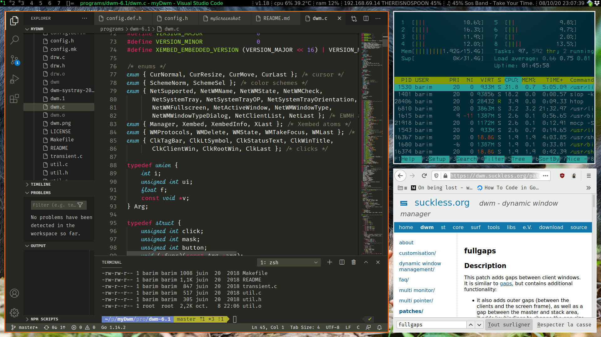

# MyDWM, a customized tiled window manager for Debian based Linux.



## Based on

* [DWM 6.0](http://dwm.suckless.org/)
* [Dmenu 4.5](http://tools.suckless.org/dmenu/)
* [Systray patch](http://dwm.suckless.org/patches/systray)
* Xft patch : for [dwm](http://dwm.suckless.org/patches/xft) and [dmenu](http://tools.suckless.org/dmenu/patches/xft)
* [wmname 0.1](http://tools.suckless.org/wmname)
* [slock 1.1](http://tools.suckless.org/slock/)
* [slstatus](https://github.com/drkhsh/slstatus)

## Default configuration

* Prefix path = /usr (need root access to install)
* Preinstalled patches : systray and xft
* Font "Sans" size 12
* Command key mapped on Windows key
  * win + e : open x-file-manager (see below how to set alternatives) 
  * win + s : lock screen (type user password to unlock)
  * win + h : reduce main area
  * win + l : enlarge main area
  * win + m : monocle area
  * win + t : tiled area
  * win + shift + enter : open terminal
  * win + enter         : swap window in main area
  * win + TAB           : focus next area
  * win + shift + TAB   : focus previous area
  * win + shit + c      : close window
  * PRINTSCREEN         : select an area to screenshot and create a png in home and copy to clipboard (shell script myScreenshot)
* Multimedia keys pilot moc "music on console" (shell script myMocp)
* Volume keys pilot PulseAudio (shell script pavol)

## Screen Layout

You can configure your screen layout by placing a shell file "main.sh" in the folder ".screenlayout" in your home directory.
If the file exists, it will be executed at xinit, and if not, there is a minimal fall back inside the .xinitrc file.

*TIPS* : you can use arandr to generate the correct screen layout shell command.

## Make and install

```sh
    ./install
```

* Makes and installs the programs in /usr/bin.
* Copy shell scripts in /usr/bin. (dwm-loop, pavol)
* Copy dotfiles in $HOME. (backup existings ones).
* Apt-install other apps (xsettingsd, blueman, feh, moc)

## Bump version

```sh
./bumpversion.sh && ./install
```

Accept the suggestion (patch increment) or type the new version.
It will update version in slstatus so it is displayed in status bar.
Then install.

## Troubleshoot

Linux user : if you got a fatal error on "/usr/include/ft2build.h", not finding "freetype/config/ftheader.h" then create the symbolic link as below :

```sh
        sudo ln -s /usr/include/freetype2/freetype/ /usr/include/
```

## How to install new alternative "x-file-manager" ?

For example, to install thunar as an alternative for x-file-manager :

```sh
        # For thunar
        sudo update-alternatives --install /usr/bin/x-file-manager x-file-manager /usr/bin/thunar 1000
        sudo update-alternatives --set x-file-manager /usr/bin/thunar
        
        # For nautilus (install alternative and prevent nautilus to open desktop) 
        sudo update-alternatives --install /usr/bin/x-file-manager x-file-manager /usr/bin/nautilus 1000
        sudo update-alternatives --set x-file-manager /usr/bin/nautilus
        gsettings set org.gnome.desktop.background show-desktop-icons false
```

## How to set the same font in DWM/Xft and in GTK apps ?

For example, if we want the 'Ubuntu Mono' font at size 12 :

```sh
        gsettings set org.gnome.desktop.interface monospace-font-name 'Ubuntu Mono 12'
```

